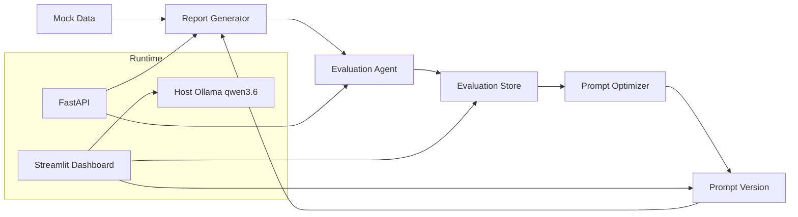

# LLM Report Evaluation Loop

LLM이 생성한 수치 해석 리포트를 Rubric 기준으로 평가하고, 그 결과를 저장해 프롬프트를 반복 개선하는 실험용 프로젝트입니다.

이 프로젝트의 핵심은 리포트를 “잘 쓰는 것”보다, 생성과 평가를 분리해서 품질을 측정하고 개선하는 구조를 만드는 데 있습니다.  
Mock 지표 데이터를 만들고, 리포트 생성기와 평가기를 분리하고, SQLite에 결과를 저장한 뒤, 프롬프트 버전별 점수 변화를 비교합니다.

## 프로젝트 설명

이 저장소는 다음 흐름을 구현합니다.

1. Mock 데이터 생성
2. Markdown 리포트 생성
3. Rubric 기반 평가
4. SQLite 저장
5. 프롬프트 최적화
6. 재실행 및 점수 비교

실제 운영 데이터를 쓰지 않고도 LLM 평가 루프를 재현할 수 있게 만든 것이 목적입니다.  
로컬에서는 heuristic 백엔드로도 실행할 수 있고, 호스트에서 실행 중인 Ollama의 `qwen3.6`을 연결할 수 있습니다.

## 아키텍처



### 구성 설명

- `data/`: Marketplace, App Engagement, Signup Funnel용 mock 데이터
- `prompts/`: 생성기, 평가기, 최적화기용 YAML 프롬프트
- `core/`: 리포트 생성, 평가, 프롬프트 로딩, 최적화, 루프 오케스트레이션
- `storage/`: SQLite 저장소
- `app/`: FastAPI 진입점
- `dashboard/`: Streamlit 대시보드
- `tests/`: 핵심 동작을 검증하는 단위 테스트

## 기술 스택

- **Language**: Python
- **API Server**: FastAPI
- **UI**: Streamlit
- **LLM Backend**: Ollama `qwen3.6`
- **Persistence**: SQLite
- **Prompt Format**: YAML
- **Testing**: `unittest`
- **Container**: Docker, Docker Compose

## 고민한 점

### 1. 생성기와 평가기를 분리했다

리포트를 만드는 모델과 평가하는 모델의 역할을 분리했습니다.  
이렇게 하면 “생성 품질”과 “평가 품질”을 따로 관찰할 수 있고, 프롬프트 개선이 실제로 점수에 어떤 영향을 주는지 보기 쉬워집니다.

### 2. 프롬프트 버전을 파일 해시로 관리했다

`prompts/*.yaml` 파일의 라벨만 저장하면, 나중에 파일을 수정했을 때 과거 실행 결과의 재현성이 깨집니다.  
그래서 `label@sha256앞8자리` 형식으로 버저닝해서, 저장된 run이 어떤 프롬프트 내용으로 생성됐는지 추적할 수 있게 했습니다.

### 3. 외부 API가 없어도 돌아가게 했다

로컬 개발 환경에서는 Ollama가 없을 수도 있기 때문에, heuristic 백엔드를 기본 fallback으로 뒀습니다.  
이렇게 해두면 UI, 저장소, 루프 오케스트레이션은 API 키 없이도 확인할 수 있습니다.

### 4. 평가 결과를 재작성하지 않게 했다

평가기는 리포트를 고쳐 쓰지 않고 점수와 실패 문장, 이유, 개선 제안만 반환하도록 분리했습니다.  
이 제약이 있어야 생성 결과와 평가 결과를 섞지 않고 비교할 수 있습니다.

### 5. 루프는 짧게 제한했다

MVP에서는 최대 3회만 자동 반복하고, 이전 바퀴보다 점수가 떨어지면 즉시 멈추도록 했습니다.  
장기 자동 최적화보다, 짧은 피드백 루프로 버전별 변화와 실패 양상을 관찰하는 쪽이 이 프로젝트의 목적에 더 맞습니다.

## 실행 방법

### 로컬 실행

```bash
uvicorn app.main:app --host 127.0.0.1 --port 8000
```

```bash
streamlit run dashboard/streamlit_app.py
```

### Docker 실행

```bash
docker compose up --build
```

그 전에 호스트에서 Ollama를 실행하고 `qwen3.6`을 받아 둡니다.

```bash
ollama serve
ollama pull qwen3.6
```

접속 주소:

- API: `http://localhost:8000`
- Dashboard: `http://localhost:8501`

Docker는 API와 Dashboard만 띄우고, Ollama와 모델 캐시는 호스트가 직접 관리합니다.

## 레이아웃

- `core/` - 생성, 평가, 프롬프트 로딩, 최적화, 루프 제어
- `storage/` - SQLite 저장
- `app/` - FastAPI API
- `dashboard/` - Streamlit UI
- `data/` - mock 데이터
- `prompts/` - YAML 프롬프트
- `tests/` - 단위 테스트
