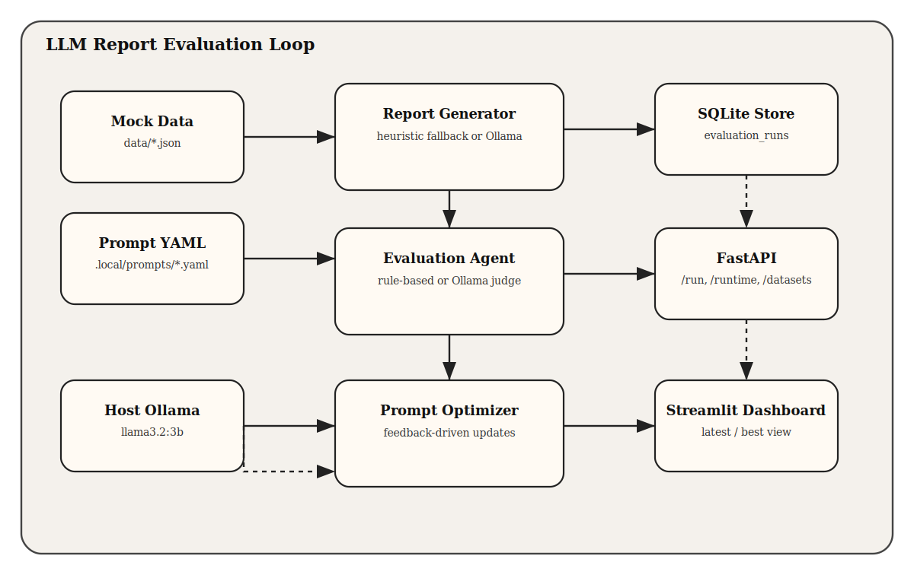

# LLM Report Evaluation Loop

LLM이 생성한 수치 해석 리포트를 Rubric 기준으로 평가하고, 그 결과를 저장해 프롬프트를 반복 개선하는 실험용 프로젝트입니다.

이 프로젝트는 생성과 평가를 분리해서 품질을 측정하고 개선하는 구조를 만드는 데 초점을 둡니다.  
Mock 지표 데이터를 만들고, 리포트 생성기와 평가기를 분리하고, SQLite에 결과를 저장한 뒤, 프롬프트 버전별 점수 변화를 비교합니다.

## 프로젝트 설명

이 저장소는 다음 흐름을 구현합니다.

1. Mock 데이터 생성
2. Markdown 리포트 생성
3. Rubric 기반 평가
4. SQLite 저장
5. 프롬프트 최적화
6. 재실행 및 점수 비교

실제 운영 데이터를 쓰지 않고도 LLM 평가 루프를 재현할 수 있게 만든 것이 목적입니다.  
호스트에서 실행 중인 Ollama의 `llama3.2:3b`를 연결해서 실행합니다. Ollama가 안 붙으면 에러가 납니다.

## 아키텍처



Excalidraw source: [`docs/architecture.excalidraw`](docs/architecture.excalidraw)

### 구성 설명

- `data/`: Marketplace, App Engagement, Signup Funnel용 mock 데이터
- `.local/prompts/`: 생성기, 평가기, 최적화기용 로컬 YAML 프롬프트
- `core/`: 리포트 생성, 평가, 프롬프트 로딩, 최적화, 루프 오케스트레이션
- `storage/`: SQLite 저장소
- `app/`: FastAPI 진입점
- `dashboard/`: Streamlit 대시보드
- `tests/`: 핵심 동작을 검증하는 단위 테스트

## 기술 스택

- **Language**: Python
- **API Server**: FastAPI
- **UI**: Streamlit
- **LLM Backend**: Ollama `llama3.2:3b`
- **Persistence**: SQLite
- **Prompt Format**: YAML
- **Testing**: `unittest`
- **Container**: Docker, Docker Compose

## 고민한 점

### 1. 명확한 정지 조건 (Termination Criteria)

`overall score`만 보지 않고, 점수 체크리스트와 필수 섹션 조건을 합격 기준으로 두었습니다. `passed_acceptance_criteria`가 되면 멈추고, 점수가 내려가거나 회차 한도에 닿아도 종료합니다.

### 2. 역할 분리 (Maker-Checker)

생성기는 리포트를 만들기만 하고, 평가는 rubric 점수와 실패 문장만 내놓게 했습니다.

### 3. 상태 보존 (State Persistence)

evaluation run과 prompt history를 SQLite에 저장하고, 대시보드에서는 latest/best 결과와 저장된 프롬프트 버전을 함께 보게 했습니다. 누적 토큰 수와 경과 시간도 같이 노출합니다.

### 4. 안전한 가드레일 (Safety Guardrails)

MVP 루프는 최대 3회만 돌리고, Ollama가 안 붙으면 바로 실패합니다. `max_runtime_seconds`와 `max_total_tokens`를 넣어서, 무한 반복이나 비용 폭주를 방지했습니다. Ollama 응답의 `prompt_eval_count`와 `eval_count`를 읽어 실제 사용량도 계산합니다.

## 실행 방법

### 로컬 실행

```bash
uvicorn app.main:app --host 127.0.0.1 --port 8000
```

```bash
streamlit run dashboard/streamlit_app.py
```

### Docker 실행

```bash
docker compose up --build
```

그 전에 호스트에서 Ollama를 실행하고 `llama3.2:3b`을 받아 둡니다.

프롬프트 파일은 `.local/prompts/generator_v1.yaml` 같은 경로에 둡니다.

```bash
ollama serve
ollama pull llama3.2:3b
```

접속 주소:

- API: `http://localhost:8000`
- Dashboard: `http://localhost:8501`

Docker는 API와 Dashboard만 띄우고, Ollama와 모델 캐시는 호스트가 직접 관리합니다.

## 레이아웃

- `core/` - 생성, 평가, 프롬프트 로딩, 최적화, 루프 제어
- `storage/` - SQLite 저장
- `app/` - FastAPI API
- `dashboard/` - Streamlit UI
- `data/` - mock 데이터
- `.local/prompts/` - YAML 프롬프트
- `tests/` - 단위 테스트
